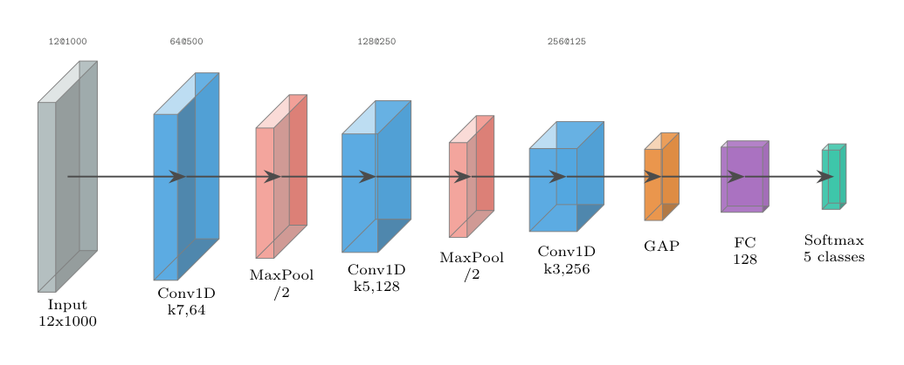
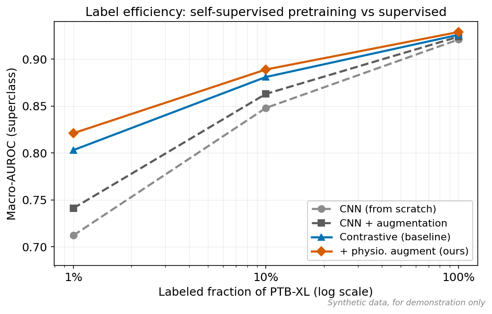
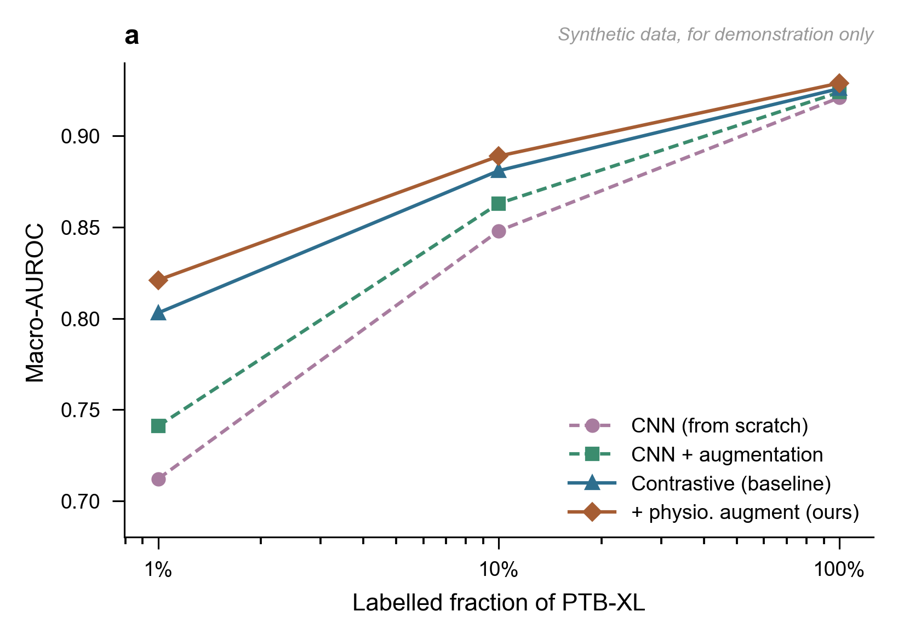

Figures are where a paper is won or lost, and also where LaTeX chooses violence. Researcher generates four kinds of publication-ready visual, each as source you own plus a rendered preview. Everything below is from the worked examples in the repository, on one running scenario: self-supervised pretraining for ECG arrhythmia classification.

## Architecture diagram (TikZ)

> Make a TikZ diagram of my two-stage pipeline: contrastive pretraining on unlabeled 12-lead ECG, then fine-tuning on PTB-XL. Standalone, colorblind-safe.

The `tikz-diagrams` skill picks a system-architecture layout, groups the two stages, and emits a standalone `.tex` that compiles on its own.

## Neural-network architecture (PlotNeuralNet style)

> Draw a PlotNeuralNet-style 3D diagram of my 1D-CNN ECG encoder. It must compile without the PlotNeuralNet repo.

The `plotneuralnet` skill inlines every layer macro, so the file is self-contained. Box height shrinks as the signal is pooled; width grows with channel count.

## Results table (booktabs)

> Turn this results CSV into a publication-quality table: group by supervised vs self-supervised, bold the best in each column, add significance markers.

The `latex-tables` skill follows booktabs rules (no vertical lines, `\toprule`/`\midrule`/`\bottomrule`), bolds the best per column, and puts significance markers in a table note. Synthetic demonstration data is labeled as such.

## Chart (matplotlib)

> Plot macro-AUROC vs labeled fraction, one line per method, log x-axis, colorblind-safe.

The `visualization` skill chooses a line plot on a log axis (a trend, not a comparison of categories), keeps the same palette as the diagram, and draws the self-supervised methods as solid lines against dashed supervised baselines.

## Journal style presets

Named presets restyle a figure for a target journal without touching the data. Three ship today, defined in [`references/figure-styles.md`](https://github.com/sokolmarek/researcher/blob/main/references/figure-styles.md): `default`, `nature`, and `ieee`. Pin one explicitly with a `Style:` line in your request (`Style: nature`, `Style: ieee`), ask for it by name ("restyle this for Nature"), or let the skill pick it up from your manuscript's target journal. Those three selectors resolve in that order of precedence, and no `Style:` line at all (or `Style: default`) is the no-op path.

Here is the same label-efficiency plot under the `default` and `nature` presets:

| `default` preset | `nature` preset |
| --- | --- |
|  |  |

The Nature variant applies 89 mm single-column sizing, sans-serif type, hairline axes, a muted palette, and a bold lowercase panel letter. Every plotted value is identical: only the styling changes.

Presets are not a matplotlib-only feature. The same two presets restyle the TikZ architecture diagram:

| `default` preset | `nature` preset |
| --- | --- |
|  |  |

Here the preset swaps typography, stroke weights, arrowheads, and fills, and adds the bold lowercase panel letter. The topology (nodes, edges, labels, meaning) is untouched. Both palettes are the shipped ones: each variant copies its hexes straight out of the reference file rather than hand-picking them, so what you see here is what the preset produces.

## Conceptual art via external generators

For visuals that are not data, the `image-prompt-crafting` skill crafts prompts for external image generators (ChatGPT/DALL-E, Gemini, Midjourney). It covers conceptual illustrations, graphical abstracts, and cover art only, never data or results figures, and it always requires an AI-disclosure caption on the resulting image.

:::tip[Every figure is compile-checked]
Diagrams and tables are compile-checked with your TeX engine before you ever see them (tectonic is recommended, but TeX Live, MiKTeX, and MacTeX all work: `scripts/latex-compile.py` autodetects whichever you have installed), and charts are rendered from the code shown. If it appears in your docs, it built.
:::

The full source for each of these lives in [`examples/visualization-latex/`](https://github.com/sokolmarek/researcher/tree/main/examples/visualization-latex).
