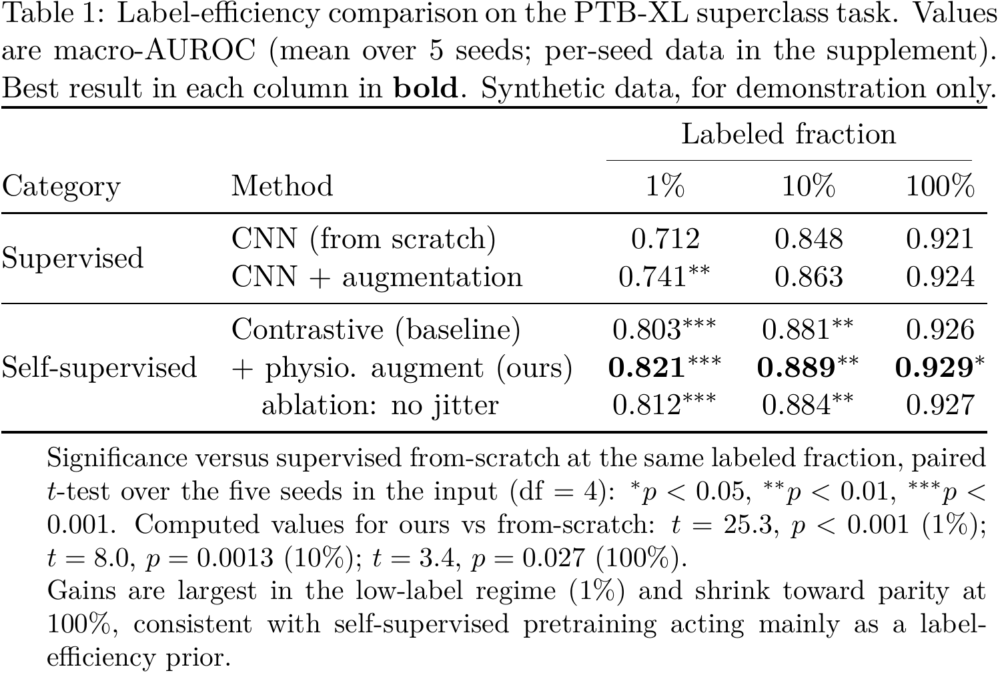

# Example: Publication-Quality Results Table

| Field | Value |
|---|---|
| Skill | latex-tables |
| Command | n/a |
| Trigger phrase | "Turn this results CSV into a booktabs table with the best result bold and significance markers" |
| Connectors used | none |
| Generated | 2026-07-12; statistics recomputed and recompiled with tectonic on 2026-07-14 |

## Invocation

> Turn this CSV of my per-seed label-efficiency results into a publication-quality LaTeX table: group by supervised vs self-supervised, report seed means, bold the best in each column, compute paired-test significance markers, and add table notes.

## Input

The CSV below is `(synthetic, for demonstration)`; these are illustrative numbers, not measured
results. It contains one row per training seed (five seeds per method), because significance
markers can only be computed from per-seed observations, never from means alone.

```csv
category,method,seed,frac_1,frac_10,frac_100
Supervised,CNN (from scratch),1,0.7010,0.8350,0.9150
Supervised,CNN (from scratch),2,0.7065,0.8415,0.9180
Supervised,CNN (from scratch),3,0.7120,0.8480,0.9210
Supervised,CNN (from scratch),4,0.7175,0.8545,0.9240
Supervised,CNN (from scratch),5,0.7230,0.8610,0.9270
Supervised,CNN + augmentation,1,0.7322,0.8526,0.9192
Supervised,CNN + augmentation,2,0.7476,0.8708,0.9276
Supervised,CNN + augmentation,3,0.7377,0.8591,0.9222
Supervised,CNN + augmentation,4,0.7509,0.8747,0.9294
Supervised,CNN + augmentation,5,0.7366,0.8578,0.9216
Self-supervised,Contrastive (baseline),1,0.8107,0.8901,0.9302
Self-supervised,Contrastive (baseline),2,0.7931,0.8693,0.9206
Self-supervised,Contrastive (baseline),3,0.8074,0.8862,0.9284
Self-supervised,Contrastive (baseline),4,0.7964,0.8732,0.9224
Self-supervised,Contrastive (baseline),5,0.8074,0.8862,0.9284
Self-supervised,+ physio. augment (ours),1,0.8155,0.8825,0.9260
Self-supervised,+ physio. augment (ours),2,0.8298,0.8994,0.9338
Self-supervised,+ physio. augment (ours),3,0.8133,0.8799,0.9248
Self-supervised,+ physio. augment (ours),4,0.8221,0.8903,0.9296
Self-supervised,+ physio. augment (ours),5,0.8243,0.8929,0.9308
Self-supervised,ablation: no jitter,1,0.8164,0.8892,0.9294
Self-supervised,ablation: no jitter,2,0.8098,0.8814,0.9258
Self-supervised,ablation: no jitter,3,0.8186,0.8918,0.9306
Self-supervised,ablation: no jitter,4,0.8021,0.8723,0.9216
Self-supervised,ablation: no jitter,5,0.8131,0.8853,0.9276
```

Seed means (what the table reports): from scratch 0.712/0.848/0.921, + augmentation
0.741/0.863/0.924, contrastive 0.803/0.881/0.926, ours 0.821/0.889/0.929, no jitter
0.812/0.884/0.927.

## Output

Compiles with any TeX engine (tectonic, TeX Live, MiKTeX, MacTeX); requires `booktabs`, `multirow`,
`threeparttable`. Verified with tectonic on 2026-07-14. Every star below is computed from the per-seed
input with a paired $t$-test against the supervised from-scratch baseline at the same labeled fraction
(df = 4).

```latex
\begin{table}[htbp]
\centering
\caption{Label-efficiency comparison on the PTB-XL superclass task. Values are
macro-AUROC (mean over 5 seeds; per-seed data in the supplement). Best result in
each column in \textbf{bold}. Synthetic data, for demonstration only.}
\label{tab:labeleff}
\begin{threeparttable}
\begin{tabular}{@{}ll*{3}{c}@{}}
\toprule
& & \multicolumn{3}{c}{Labeled fraction} \\
\cmidrule(lr){3-5}
Category & Method & 1\% & 10\% & 100\% \\
\midrule
\multirow{2}{*}{Supervised}
  & CNN (from scratch)        & 0.712          & 0.848          & 0.921 \\
  & CNN + augmentation        & 0.741$^{**}$   & 0.863          & 0.924 \\
\midrule
\multirow{3}{*}{Self-supervised}
  & Contrastive (baseline)    & 0.803$^{***}$  & 0.881$^{**}$   & 0.926 \\
  & + physio. augment (ours)  & \textbf{0.821}$^{***}$ & \textbf{0.889}$^{**}$ & \textbf{0.929}$^{*}$ \\
  & \quad ablation: no jitter & 0.812$^{***}$  & 0.884$^{**}$   & 0.927 \\
\bottomrule
\end{tabular}
\begin{tablenotes}\small
\item Significance versus supervised from-scratch at the same labeled fraction, paired
$t$-test over the five seeds in the input (df $=4$): $^{*}p<0.05$, $^{**}p<0.01$,
$^{***}p<0.001$. Computed values for ours vs from-scratch: $t=25.3$, $p<0.001$ (1\%);
$t=8.0$, $p=0.0013$ (10\%); $t=3.4$, $p=0.027$ (100\%).
\item Gains are largest in the low-label regime (1\%) and shrink toward parity at 100\%,
consistent with self-supervised pretraining acting mainly as a label-efficiency prior.
\end{tablenotes}
\end{threeparttable}
\end{table}
```

### Word (docx-js) equivalent, note

For Word output the same structure maps to the `docx` library's `Table`: a merged "Labeled
fraction" cell spanning three columns above the 1/10/100 columns, bold runs on the best cell per
column, and the significance legend as a paragraph below (booktabs rules become top/mid/bottom
borders, since Word has no `\toprule`). The shipped `templates/word/build-docx.js` currently
generates headings, paragraphs, and lists; table emission per this mapping is planned and specified
in `templates/word/article-imrad.md`.

## Rendered output

The table above compiles to (rasterized here for preview):



## What this demonstrates

- CSV to booktabs conversion following every rule in `references/table-patterns.md`: `\toprule`/`\midrule`/`\bottomrule` (no vertical rules), `@{}` outer padding removed, numbers centered, best-in-column bolded, `\multirow` category groups, a `\cmidrule` under the spanning header, and significance markers explained in `threeparttable` notes.
- Significance is COMPUTED, never asserted: the input carries per-seed observations, the stars come from paired t-tests over those seeds, and the note states the test, the degrees of freedom, and representative t and p values. A means-only CSV cannot produce stars.
- Synthetic experimental data is labeled as such in both the caption and the input, honoring the never-invent-data constraint while still showing realistic table structure.
- The table caption sits above the table (tables) versus figure captions below (figures), matching house convention.
- A note maps the same table to the Word/docx-js path, so the example covers both output modes.
- Compile-checks with any TeX engine (tectonic, TeX Live, MiKTeX, MacTeX); verified with tectonic before inclusion.
