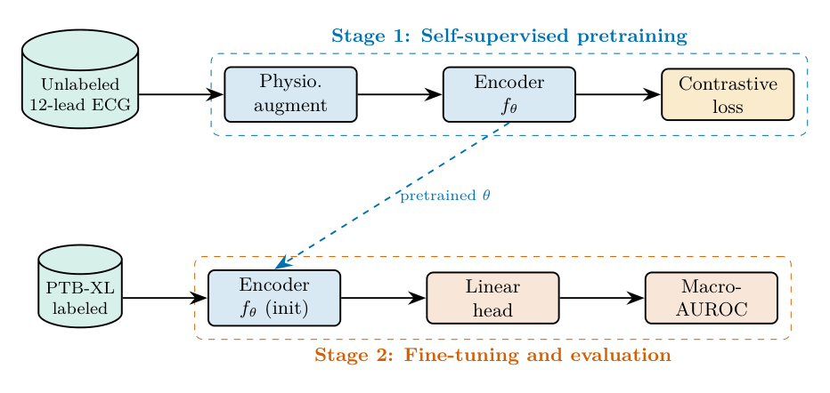
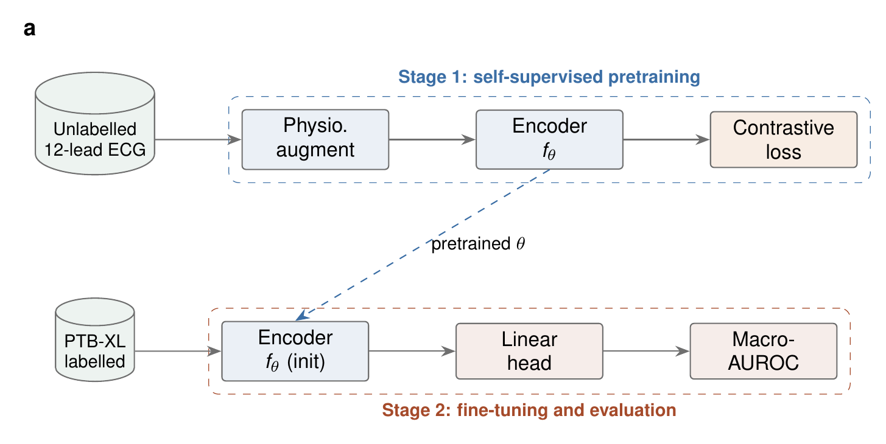

# Example: TikZ Architecture Diagram

| Field | Value |
|---|---|
| Skill | tikz-diagrams |
| Command | n/a |
| Trigger phrase | "Make a TikZ diagram of my two-stage SSL pretraining and fine-tuning pipeline" |
| Connectors used | none |
| Generated | 2026-07-12; compiles with any TeX engine (tectonic, TeX Live, MiKTeX, MacTeX), verified with tectonic on this date |

## Invocation

> Make a TikZ diagram of my two-stage pipeline: self-supervised contrastive pretraining on unlabeled 12-lead ECG, then fine-tuning on PTB-XL labels. I want it as a standalone compilable figure with colorblind-safe colors.

## Input

Pipeline description (above). Style drawn from `references/tikz-patterns.md` (Pattern 1 system architecture, Pattern 9 experimental setup, colorblind-safe palette).

## Output

Standalone `.tex`, compiles to a cropped PDF with any TeX engine (tectonic, TeX Live, MiKTeX, MacTeX). Verified: compiled with tectonic on 2026-07-12.

```latex
\documentclass[border=10pt]{standalone}
\usepackage{tikz}
\usetikzlibrary{arrows.meta, positioning, shapes.geometric, calc, fit, backgrounds}

\definecolor{cb-blue}{HTML}{0072B2}
\definecolor{cb-orange}{HTML}{E69F00}
\definecolor{cb-green}{HTML}{009E73}
\definecolor{cb-red}{HTML}{D55E00}

\begin{document}
\begin{tikzpicture}[
    node distance=1.1cm and 1.4cm,
    stage/.style={rectangle, rounded corners=3pt, draw, thick, align=center,
                  minimum height=2.4em, minimum width=6.2em, font=\small},
    data/.style={cylinder, shape border rotate=90, draw, thick, fill=cb-green!15,
                 aspect=0.35, minimum height=2.6em, minimum width=3em, align=center, font=\footnotesize},
    arrow/.style={-{Stealth[length=3mm]}, thick},
    phaselabel/.style={font=\small\bfseries}
]

% Data stores
\node[data] (unlabeled) {Unlabeled\\12-lead ECG};
\node[data, below=1.9cm of unlabeled] (labeled) {PTB-XL\\labeled};

% Pretraining stage
\node[stage, fill=cb-blue!15, right=of unlabeled] (aug) {Physio.\\augment};
\node[stage, fill=cb-blue!15, right=of aug] (encoder1) {Encoder\\$f_\theta$};
\node[stage, fill=cb-orange!20, right=of encoder1] (contrast) {Contrastive\\loss};

% Fine-tuning stage
\node[stage, fill=cb-blue!15, right=of labeled] (encoder2) {Encoder\\$f_\theta$ (init)};
\node[stage, fill=cb-red!15, right=of encoder2] (head) {Linear\\head};
\node[stage, fill=cb-red!15, right=of head] (eval) {Macro-\\AUROC};

% Weight transfer
\draw[arrow, dashed, cb-blue] (encoder1.south) -- node[right, font=\scriptsize] {pretrained $\theta$} (encoder2.north);

% Pretraining flow
\draw[arrow] (unlabeled) -- (aug);
\draw[arrow] (aug) -- (encoder1);
\draw[arrow] (encoder1) -- (contrast);

% Fine-tuning flow
\draw[arrow] (labeled) -- (encoder2);
\draw[arrow] (encoder2) -- (head);
\draw[arrow] (head) -- (eval);

% Phase backgrounds
\begin{scope}[on background layer]
    \node[fit=(aug)(contrast), draw=cb-blue, dashed, rounded corners, inner sep=6pt,
          label={[phaselabel, cb-blue]above:Stage 1: Self-supervised pretraining}] {};
    \node[fit=(encoder2)(eval), draw=cb-red, dashed, rounded corners, inner sep=6pt,
          label={[phaselabel, cb-red]below:Stage 2: Fine-tuning and evaluation}] {};
\end{scope}

\end{tikzpicture}
\end{document}
```

## Rendered output

The `.tex` above compiles to this figure (rasterized here for preview):



## Nature-style variant

Same request, one clause added:

> ... in Nature style, single column.

The `nature` preset in `references/figure-styles.md` swaps the typography and weights: Helvetica-like
sans-serif node text, hairline 0.5 pt strokes, smaller arrowheads, muted fills, and a bold lowercase
panel letter. The topology, the node text, and the pipeline are unchanged.

```latex
\documentclass[border=6pt]{standalone}
\usepackage[T1]{fontenc}
\usepackage{helvet}
\renewcommand{\familydefault}{\sfdefault}
\usepackage{sansmath}
\sansmath
\usepackage{tikz}
\usetikzlibrary{arrows.meta, positioning, shapes.geometric, calc, fit, backgrounds}

\definecolor{nat-blue}{HTML}{3B6EA5}
\definecolor{nat-orange}{HTML}{C1671A}
\definecolor{nat-green}{HTML}{4C8C6B}
\definecolor{nat-red}{HTML}{A54A2A}
\definecolor{nat-grey}{HTML}{6F6F6F}

\begin{document}
\begin{tikzpicture}[
    node distance=0.9cm and 1.2cm,
    stage/.style={rectangle, rounded corners=1.5pt, draw=nat-grey, line width=0.5pt,
                  align=center, minimum height=2.2em, minimum width=5.8em,
                  font=\sffamily\footnotesize},
    data/.style={cylinder, shape border rotate=90, draw=nat-grey, line width=0.5pt,
                 fill=nat-green!10, aspect=0.35, minimum height=2.4em, minimum width=2.8em,
                 align=center, font=\sffamily\scriptsize},
    arrow/.style={-{Stealth[length=2mm]}, line width=0.5pt, draw=nat-grey},
    phaselabel/.style={font=\sffamily\scriptsize\bfseries}
]

\node[data] (unlabeled) {Unlabelled\\12-lead ECG};
\node[data, below=1.7cm of unlabeled] (labeled) {PTB-XL\\labelled};

\node[stage, fill=nat-blue!10, right=of unlabeled] (aug) {Physio.\\augment};
\node[stage, fill=nat-blue!10, right=of aug] (encoder1) {Encoder\\$f_\theta$};
\node[stage, fill=nat-orange!12, right=of encoder1] (contrast) {Contrastive\\loss};

\node[stage, fill=nat-blue!10, right=of labeled] (encoder2) {Encoder\\$f_\theta$ (init)};
\node[stage, fill=nat-red!10, right=of encoder2] (head) {Linear\\head};
\node[stage, fill=nat-red!10, right=of head] (eval) {Macro-\\AUROC};

\draw[arrow, dashed, draw=nat-blue] (encoder1.south) --
      node[right, font=\sffamily\scriptsize] {pretrained $\theta$} (encoder2.north);

\draw[arrow] (unlabeled) -- (aug);
\draw[arrow] (aug) -- (encoder1);
\draw[arrow] (encoder1) -- (contrast);

\draw[arrow] (labeled) -- (encoder2);
\draw[arrow] (encoder2) -- (head);
\draw[arrow] (head) -- (eval);

\begin{scope}[on background layer]
    \node[fit=(aug)(contrast), draw=nat-blue, dashed, line width=0.3pt, rounded corners,
          inner sep=5pt,
          label={[phaselabel, nat-blue]above:Stage 1: self-supervised pretraining}] {};
    \node[fit=(encoder2)(eval), draw=nat-red, dashed, line width=0.3pt, rounded corners,
          inner sep=5pt,
          label={[phaselabel, nat-red]below:Stage 2: fine-tuning and evaluation}] {};
\end{scope}

\node[anchor=south west, font=\sffamily\small\bfseries]
      at ($(unlabeled.north west) + (-0.35, 0.55)$) {a};

\end{tikzpicture}
\end{document}
```



## What this demonstrates

- The skill selects a system-architecture layout (boxes, cylinders for data stores, dashed weight-transfer arrow) appropriate to a two-stage training pipeline, and groups the stages with labeled background boxes using the `backgrounds` and `fit` libraries.
- Colors come from the colorblind-safe palette in `references/tikz-patterns.md`, not arbitrary choices.
- The output is a `standalone` document so it compiles on its own to a cropped figure with any TeX engine (tectonic, TeX Live, MiKTeX, MacTeX), and it was compile-verified with tectonic before being included here.
- The diagram depicts the same model as the `plotneuralnet-cnn` example and the manuscript in the writing examples, keeping the set consistent.
- The Nature variant shows what a style preset does and does not touch: typography, stroke weights, arrowheads, fills, and panel lettering change, while the pipeline itself (nodes, edges, labels, meaning) is untouched. Both variants compile with any TeX engine (tectonic, TeX Live, MiKTeX, MacTeX); both were verified with tectonic.
